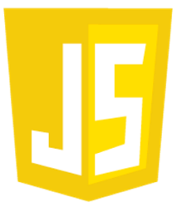

# StarMist

## 📋 Description:
    
StarMist is a groundbreaking space project focused on advancing science and physics. Their spacecraft, StarLight, incorporates three compact versions of the Mars rover "Perseverance" to explore the galaxy. With an innovative electric thruster and large solar panels, StarLight travels at 6000 km/s, reaching Proxima Centauri to deploy the rovers and gather vital planetary data. StarMist's mission aims to revolutionize space exploration and deepen our understanding of the universe.

## 🖥 Team Members:
* **Simeon Vangelov** - *Front-end developer* 
* **Kristian Dimitrov** - *Front-end developer* 
* **Martin Dimitrov** - *Scrumtrainer* 
* **Nikolai Kalashnik** - *Designer* 
* **Gabriel Dimitrov** - *Mentor*

## 🚀 Languages and tools:

 
     
     
     
    

## http://projectpgkpi.eu3.biz